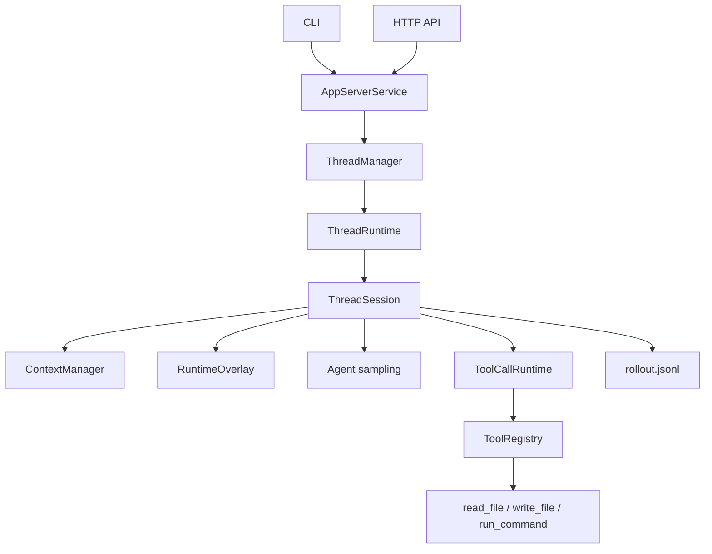

# ExAgent

ExAgent is a Rust-based agent runtime that adds durable thread state, replayable events, approval-gated tool execution, live event delivery, and a small app-server boundary on top of an LLM tool loop.

## Why This Exists

Many agent demos stop at "prompt in, tool call out". ExAgent focuses on the runtime substrate underneath that loop:

- durable `rollout.jsonl` thread records for recovery
- append-only rollout history for replay and auditability
- persistent exec sessions for long-lived subprocess workflows
- approval-gated command execution for risky shell actions
- thread and turn lifecycle operations behind a typed boundary
- live event subscription for UI and CLI clients

This repository is intentionally scoped as runtime infrastructure, not as a full autonomous planner or production sandbox.

## Current Capabilities

- Start, resume, read, and advance LLM-backed runtime threads
- Persist thread state under `.exagent/threads/<thread_id>/rollout.jsonl`
- Replay persisted runtime events from rollout history
- Subscribe to live runtime events over HTTP SSE
- Interrupt active turns or pending approval waits
- Keep interactive subprocesses alive across turns
- Expose CLI and HTTP API entrypoints

## Architecture

The runtime keeps one execution kernel and exposes it through a small app-server boundary. Loaded threads are handled by a long-lived runtime actor; disk remains the replay and recovery store.



Key persistence rule:

- `rollout.jsonl` is the durable source of truth for new thread records
- legacy `snapshot.json` and `events.jsonl` files are not runtime inputs; v2 still returns their paths as compatibility-only fields
- `ContextManager` owns prompt-visible history while a thread is loaded
- `RuntimeOverlay` owns live-only approvals and open exec session references
- cold rollout replay never recreates live-only approvals or running exec sessions

## Quickstart

### Prerequisites

- Rust toolchain
- Access to an OpenAI-compatible chat-completions endpoint

The binary reads environment variables directly. There is no built-in dotenv loader.

### 1. Configure environment

Use [.env.example](.env.example) as a reference and export the variables in your shell:

```bash
export OPENAI_BASE_URL="https://api.openai.com/v1"
export OPENAI_API_KEY="your-api-key"
export OPENAI_MODEL="gpt-4.1"
export EXAGENT_POLICY_MODE="off"
```

Accepted `EXAGENT_POLICY_MODE` values are `off`, `advisory`, and `enforced`.

### 2. Run the test suite

```bash
cargo test
```

### 3. Start the API server

```bash
cargo run -- api
```

By default the API listens on `127.0.0.1:3000`.

### 4. Confirm protocol capabilities

```bash
curl -s http://127.0.0.1:3000/initialize \
  -H 'content-type: application/json' \
  -d '{}'
```

The response reports `appserver-runtime-boundary-v2` and the supported operations.

### 5. Start a thread

```bash
curl -s http://127.0.0.1:3000/thread/start \
  -H 'content-type: application/json' \
  -d '{
    "workspace_root": ".",
    "cwd": "."
  }'
```

Save `thread.id` from the response.

### 6. Subscribe to events

In another terminal, subscribe before starting a turn:

```bash
curl -N -s http://127.0.0.1:3000/events/subscribe \
  -H 'content-type: application/json' \
  -d '{
    "thread_id": "<thread-id>",
    "workspace_root": "."
  }'
```

The stream first sends persisted events after the optional cursor, then switches to live `RuntimeEvent` values.

### 7. Start a turn

```bash
curl -s http://127.0.0.1:3000/turn/start \
  -H 'content-type: application/json' \
  -d '{
    "thread_id": "<thread-id>",
    "prompt": "Inspect this Rust workspace and summarize the runtime architecture.",
    "workspace_root": "."
  }'
```

`turn/start` accepts work and returns an in-progress turn. The final assistant output arrives through `events/subscribe` or can be recovered later with `events/replay`.

### 8. Replay events

```bash
curl -s http://127.0.0.1:3000/events/replay \
  -H 'content-type: application/json' \
  -d '{
    "thread_id": "<thread-id>",
    "workspace_root": ".",
    "include_snapshot": true
  }'
```

For a longer walkthrough, see [docs/demo/exagent-walkthrough.md](docs/demo/exagent-walkthrough.md).
For the client protocol contract, see [docs/protocol/app-server-boundary-v2.md](docs/protocol/app-server-boundary-v2.md).

## CLI Entry Points

The CLI is useful for direct local runs:

```bash
cargo run -- "Summarize this workspace"
cargo run -- resume <session_id> "Continue the previous session"
cargo run -- api
```

The CLI is a convenience adapter over the same thread, turn, and event boundary. The HTTP API is the easiest way to get machine-readable thread state and event streams.

## Built-In Tools

The default tool registry currently includes:

- `read_file`
- `write_file`
- `run_command`

## Project Status

Implemented today:

- rollout-backed durable thread persistence
- event-based replay
- persistent exec sessions
- policy and approval flow
- app-server runtime boundary v2
- thread-scoped runtime actor
- live-only runtime overlay for approvals and persistent exec refs
- live event subscription

Explicit non-goals today:

- no autonomous planner
- no runtime-native child thread orchestration yet
- no reduce/join scheduler
- no production-grade sandbox isolation
- no cross-process active-turn locking
- no token-delta LLM streaming

## Why Rust

Rust is a good fit here because the project is runtime infrastructure, not a one-shot script:

- explicit types for runtime ids, events, and lifecycle state
- async-safe shared state for subprocess and policy managers
- Serde-backed persistence for rollout records and runtime events
- a clear ownership model around long-lived runtime data

## Repository Layout

- [src/entrypoints](src/entrypoints): CLI and HTTP adapters
- [src/app_server](src/app_server): typed app-server boundary, protocol, thread manager
- [src/runtime](src/runtime): live execution kernel, thread actor, session turn loop, agent sampling, tool runtime, policy, exec sessions
- [src/tools](src/tools): tool trait, registry, and built-in tools
- [src/state](src/state): durable rollout models plus protocol compatibility path helpers
- [src/model](src/model): LLM client adapter and conversation/tool-call types
- [tests](tests): integration coverage for agent loop, replay, policy, exec sessions, API, and thread runtime
- [docs/plans](docs/plans): design notes, roadmap, and implementation plans
- [docs/architecture](docs/architecture): architecture and interview-oriented summaries
- [docs/protocol](docs/protocol): client-facing protocol notes

Recommended reading:

- [App-Server Boundary v2 Protocol Notes](docs/protocol/app-server-boundary-v2.md)
- [Thread Runtime Actor Design](docs/architecture/2026-05-16-exagent-thread-runtime-actor-v2-design.md)

## License

This project is licensed under the MIT License. See [LICENSE](LICENSE).
