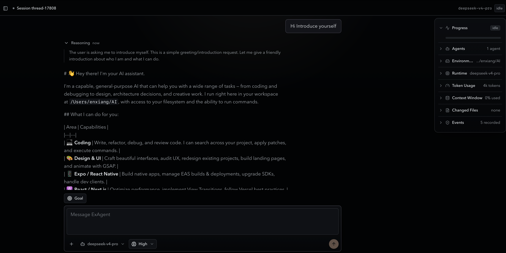

<p align="center">
  
</p>

<h1 align="center">ExAgent</h1>

<p align="center">
  A local desktop workbench for coding agents: projects, durable sessions, tool approvals, subagents, goals, and live runtime inspection in one GUI.
</p>

<p align="center">
  
</p>

## What It Is

ExAgent is a desktop-first agent workbench backed by a Rust runtime and a
Tauri/React GUI. It is built for long-running coding work inside local
projects: start a session, choose a provider/model, approve tool actions,
inspect runtime state, and resume the thread later from durable local history.

It is not just a chat UI. ExAgent includes the runtime pieces needed for
recoverable agent work: event replay, persistent shell sessions, approval-gated
tools, subagents, goal tracking, procedural memory, MCP tools, and a desktop
inspector for what the agent is doing.

## Highlights

- Desktop-first local agent workbench for coding projects
- Durable sessions that can be reopened from local project history
- GUI provider setup for API-key and OAuth-based model providers
- Approval-gated coding tools with live transcript and event inspection
- Persistent shells, subagents, goals, MCP tools, and `SKILL.md` support

## Quickstart

### Prerequisites

- Rust toolchain
- Node.js and npm
- A model provider credential you are comfortable using locally

### Start the desktop app

```bash
cd apps/desktop
npm ci
npm run tauri:dev
```

The desktop app launches the Tauri shell and Vite frontend. For normal use,
you configure providers, projects, and sessions from the GUI.

### Configure a provider

Open **Settings** -> **Providers**, then add an API-key provider or complete an
OAuth flow. Credentials are stored locally by the desktop app. Use a dedicated
project credential and keep local app data private.

### Add a project and start a session

Use the sidebar to add a local workspace directory, create a new session, type
into the composer, and submit a turn. When ExAgent needs approval for a command
or file mutation, the app shows an approval card in the transcript.

For a fuller operator walkthrough, see
[docs/demo/exagent-walkthrough.md](docs/demo/exagent-walkthrough.md).

## Development

Useful commands from `apps/desktop`:

```bash
npm ci
npm run tauri:dev
npm test
npm run build
```

Useful commands from the repository root:

```bash
cargo test --package exagent --locked
cargo test --package exagent-desktop --locked
cargo fmt --all -- --check
cargo clippy --package exagent --all-targets
cargo deny check licenses sources bans
```

## Project Status

ExAgent is an early local-first desktop project. It currently targets personal
workstation use rather than a hosted multi-user service.

Current non-goals:

- no production-grade sandbox isolation
- no hosted collaboration service
- no stable public SDK yet

## Repository Layout

- [apps/desktop](apps/desktop): Tauri desktop shell and React workbench
- [apps/desktop/src-tauri](apps/desktop/src-tauri): desktop Rust commands,
  settings, provider auth, and Tauri entrypoint
- [src/runtime](src/runtime): live execution kernel, thread actor, session turn
  loop, agent sampling, tool runtime, policy, and exec sessions
- [src/tools](src/tools): tool trait, registry, and built-in coding tools
- [src/state](src/state): durable rollout models plus desktop index storage
- [src/model](src/model): model provider adapters and conversation types
- [tests](tests): integration coverage for runtime, protocol, policy, tools,
  and storage
- [docs/demo](docs/demo): desktop-first walkthroughs

## Contributing

See [CONTRIBUTING.md](CONTRIBUTING.md) for development setup, verification
commands, and pull request expectations.

Please keep secrets out of issues, pull requests, rollout files, and logs. Use
[SECURITY.md](SECURITY.md) for vulnerability reports.

## Third-Party Notices

See [THIRD_PARTY_NOTICES.md](THIRD_PARTY_NOTICES.md) for the dependency license
policy and rules for external reference material.

## Authors And Notices

ExAgent was created by exqqstar. See [AUTHORS.md](AUTHORS.md) for authorship
and contribution attribution, and [NOTICE](NOTICE) for distribution notices.

## License

Copyright (c) 2026 exqqstar.

Licensed under either of:

- Apache License, Version 2.0 ([LICENSE-APACHE](LICENSE-APACHE))
- MIT License ([LICENSE-MIT](LICENSE-MIT))

at your option.
