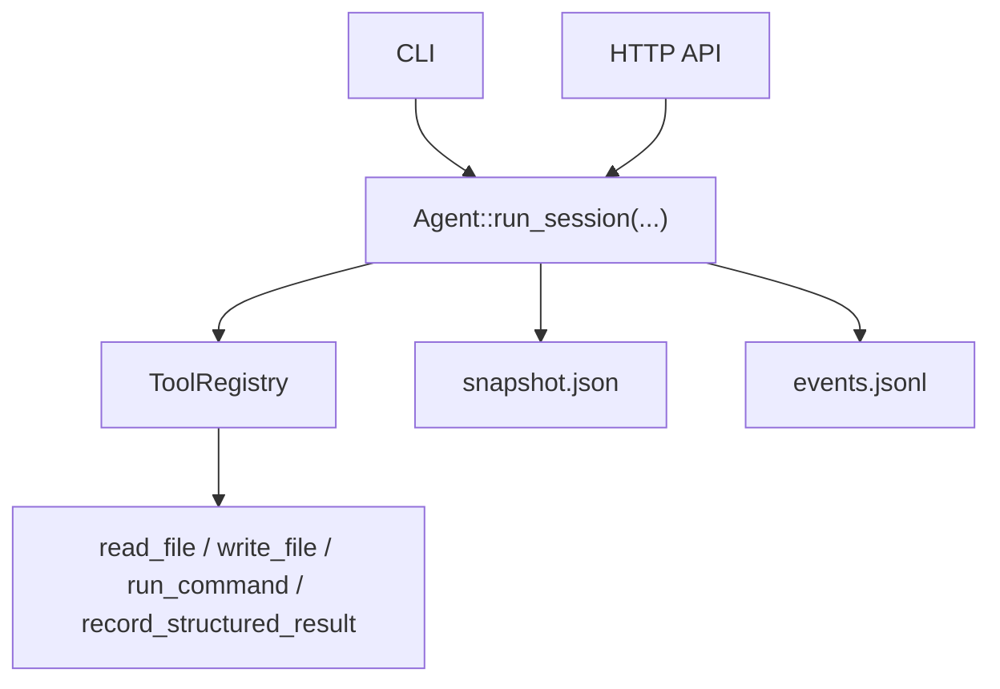

# ExAgent

ExAgent is a Rust-based agent runtime that adds durable session state, replayable events, approval-gated tool execution, and thin multi-session orchestration on top of an LLM tool loop.

## Why This Exists

Many agent demos stop at "prompt in, tool call out". ExAgent focuses on the runtime substrate underneath that loop:

- durable `snapshot.json` state for session recovery
- append-only `events.jsonl` history for replay and auditability
- persistent exec sessions for long-lived subprocess workflows
- approval-gated command execution for risky shell actions
- thin orchestration primitives for child-session `fork`, `inspect`, and `collect`
- typed result contracts for `spec`, `test`, and `judge` roles

This repository is intentionally scoped as runtime infrastructure, not as a full autonomous planner or production sandbox.

## Current Capabilities

- Run and resume LLM-backed agent sessions
- Persist session state under `.exagent/sessions/<session_id>/`
- Replay assistant turns and tool results from the event log
- Keep interactive subprocesses alive across turns
- Expose CLI and HTTP API entrypoints
- Discover child sessions and collect their latest useful output
- Record typed structured results for non-writer review roles

## Architecture

The runtime keeps one execution kernel and layers orchestration around it instead of replacing it with a planner.



Key persistence rule:

- `snapshot.json` stores current recoverable state
- `events.jsonl` stores replayable runtime facts

## Quickstart

### Prerequisites

- Rust toolchain
- Access to an OpenAI-compatible chat-completions endpoint

The binary reads environment variables directly. There is no built-in dotenv loader.

### 1. Configure environment

Use [.env.example](.env.example) as a reference and export the variables in your shell:

```bash
export OPENAI_BASE_URL="https://api.openai.com/v1"
export OPENAI_API_KEY="your-api-key"
export OPENAI_MODEL="gpt-4.1"
export EXAGENT_POLICY_MODE="off"
```

Accepted `EXAGENT_POLICY_MODE` values are `off`, `advisory`, and `enforced`.

### 2. Run the test suite

```bash
cargo test
```

### 3. Start the API server

```bash
cargo run -- api
```

By default the API listens on `127.0.0.1:3000`.

### 4. Create a root session

```bash
curl -s http://127.0.0.1:3000/run \
  -H 'content-type: application/json' \
  -d '{
    "prompt": "Inspect this Rust workspace and summarize the runtime architecture.",
    "workspace_root": ".",
    "cwd": "."
  }'
```

The response includes:

- `session_id`
- `snapshot_path`
- `events_path`
- assistant text and tool calls

### 5. Fork a child session

```bash
curl -s http://127.0.0.1:3000/fork \
  -H 'content-type: application/json' \
  -d '{
    "parent_session_id": "<root-session-id>",
    "agent_role": "spec",
    "prompt": "Draft goals, non-goals, and acceptance criteria for the next runtime milestone.",
    "workspace_root": ".",
    "spawned_by_turn_id": "turn_1"
  }'
```

### 6. Inspect and collect child work

```bash
curl -s http://127.0.0.1:3000/inspect \
  -H 'content-type: application/json' \
  -d '{
    "parent_session_id": "<root-session-id>",
    "workspace_root": "."
  }'
```

```bash
curl -s http://127.0.0.1:3000/collect \
  -H 'content-type: application/json' \
  -d '{
    "session_id": "<child-session-id>",
    "workspace_root": "."
  }'
```

For a longer walkthrough, see [docs/demo/exagent-walkthrough.md](docs/demo/exagent-walkthrough.md).

## CLI Entry Points

The CLI is useful for direct local runs:

```bash
cargo run -- "Summarize this workspace"
cargo run -- resume <session_id> "Continue the previous session"
cargo run -- fork <parent_session_id> spec "Draft milestone goals"
cargo run -- inspect <parent_session_id>
cargo run -- collect <child_session_id>
```

The HTTP API is the easiest way to get machine-readable session metadata.

## Built-In Tools

The default tool registry currently includes:

- `read_file`
- `write_file`
- `run_command`
- `record_structured_result`

## Project Status

Implemented today:

- durable session persistence
- event-based replay
- persistent exec sessions
- policy and approval flow
- thin multi-session orchestration
- typed structured review contracts

Explicit non-goals today:

- no autonomous planner
- no mailbox-based coordination
- no reduce/join scheduler
- no production-grade sandbox isolation

## Why Rust

Rust is a good fit here because the project is runtime infrastructure, not a one-shot script:

- explicit types for runtime ids, events, and lifecycle state
- async-safe shared state for subprocess and policy managers
- Serde-backed persistence for snapshots and events
- a clear ownership model around long-lived runtime data

## Repository Layout

- [src](src): runtime, API, tools, orchestration, persistence
- [tests](tests): integration coverage for agent loop, replay, policy, exec sessions, API, and orchestration
- [docs/plans](docs/plans): design notes, roadmap, and implementation plans
- [docs/architecture](docs/architecture): architecture and interview-oriented summaries

Recommended reading:

- [Phase 3 Current-State Learning Guide](docs/plans/2026-04-15-exagent-phase3-current-state-learning-guide.md)
- [Phase 3 Roadmap And Working Model](docs/plans/2026-04-15-exagent-phase3-roadmap-and-working-model-design.md)

## License

This project is licensed under the MIT License. See [LICENSE](LICENSE).
