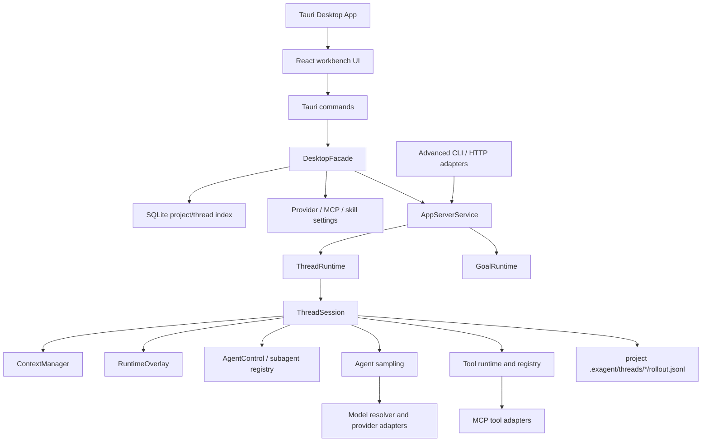

# ExAgent

ExAgent is a desktop-first agent workbench backed by a Rust runtime. The main
experience is the Tauri desktop app: add local projects, configure model
providers, start and resume durable agent threads, inspect runtime events, and
approve risky tool actions from the GUI.

The same runtime also exposes lower-level CLI and HTTP protocol adapters for
development, tests, and integrations, but they are no longer the recommended
entry point for everyday use.

ExAgent is not just a chat UI. It is a local coding-agent runtime substrate:
durable threads, replayable events, approval-gated tools, persistent shell
sessions, thread-native subagents, goal tracking, procedural memory, MCP tools,
and a desktop workbench built around observability.

## Why This Exists

Most local agent prototypes stop at prompt, sample, tool call, response. That
is not enough for long-running coding work. ExAgent focuses on the runtime
pieces that make agent work inspectable and recoverable:

- durable local state instead of process-only conversations
- append-only event and rollout history for replay and audit
- explicit separation between durable facts, live-only state, and model-visible
  context
- approval gates around risky tool execution
- long-lived subprocess sessions across turns
- multiple cooperating agent threads instead of detached background model calls
- desktop controls for provider setup, projects, sessions, goals, tools, and
  runtime events

## Current Capabilities

Desktop workbench:

- Manage local projects, indexed conversations, archived sessions, pinned
  threads, search, and project worktrees from the sidebar
- Configure model providers from Settings, including OpenAI-compatible
  endpoints, Anthropic, Google, DeepSeek, Moonshot/Kimi, Zhipu, ChatGPT OAuth,
  and GitHub Copilot OAuth
- Store provider credentials locally while keeping resolved API keys and OAuth
  tokens out of persisted runtime events
- Run turns from a composer with per-turn model, thinking-mode, and turn-mode
  choices
- Inspect live transcripts, tool calls, approvals, stdout/stderr chunks, token
  usage, runtime events, subagent trees, and goal state
- Configure MCP servers and skill roots from desktop settings

Runtime and persistence:

- Run each thread through a serialized `ThreadRuntime` actor and
  `ThreadSession` state machine
- Persist thread history under each project at
  `.exagent/threads/<thread_id>/rollout.jsonl`
- Replay cold threads from append-only rollout records and project a stable
  `ThreadView` for GUI/API clients
- Keep live-only state, such as pending approvals and open exec sessions, in a
  `RuntimeOverlay` that is not resurrected as actionable state during cold
  replay
- Track token usage and use rollout-backed logical compaction to control
  prompt-visible context without deleting old audit history

Tools, agents, and context:

- Execute built-in coding tools through a typed tool runtime with visibility,
  provider capability checks, approval interception, lifecycle events, and
  model-visible result projection
- Keep persistent shell sessions alive across turns, with `write_stdin`, live
  stdout/stderr deltas, process-group cleanup, and interrupt/cancel handling
- Spawn thread-native subagents that have their own runtime, rollout, profile,
  mailbox, and lifecycle instead of being detached one-off model calls
- Coordinate subagents through `spawn_agent`, `list_agents`, `send_message`,
  `followup_task`, `wait_agent`, and `close_agent`
- Use agent profiles such as explorer, planner, reviewer, and worker to shape
  instructions, thinking defaults, forked history, and tool policy
- Track explicit thread goals with status, token budgets, usage accounting,
  automatic continuation, and desktop goal controls
- Load procedural context from project instructions and `SKILL.md` skill roots,
  including project/global skill source scanning and shadowing warnings
- Refresh configured MCP servers and route external MCP tools through the same
  tool selection, approval, hook, and event pipeline
- Use CLI and HTTP protocol adapters as advanced integration surfaces over the
  same runtime boundary

## Quickstart

### Prerequisites

- Rust toolchain
- Node.js and npm
- A model provider credential configured in the desktop app

### 1. Install desktop dependencies

```bash
cd apps/desktop
npm ci
```

### 2. Start the desktop app

```bash
npm run tauri:dev
```

This launches the Tauri desktop shell and the Vite frontend. You do not need to
start `cargo run -- api` for normal desktop use; the desktop app calls the Rust
runtime through Tauri commands in the same application process.

### 3. Configure a provider

Open Settings, choose Providers, then configure one of the supported providers.

Common options:

- OpenAI-compatible endpoint with API key
- ChatGPT Pro/Plus through device OAuth
- GitHub Copilot through device OAuth
- Anthropic, Google, DeepSeek, Moonshot/Kimi, or Zhipu with provider-specific
  credentials

API keys and OAuth tokens are stored locally. The default file-backed secret
store avoids OS keychain prompts, but stores secrets as owner-readable local
files. Use a dedicated project credential and keep local app data private.

### 4. Add a project

Use the sidebar's Add project control and choose a local workspace directory.
ExAgent indexes existing `.exagent/threads` records for that project, then uses
the selected project path as the workspace root for new sessions.

### 5. Start a session

Use New session, type into the composer, and submit a turn. The desktop app
creates or resumes a runtime thread, subscribes to live runtime events, and
updates the transcript and inspector as the turn runs.

When a tool action requires approval, the GUI renders an approval card. Approve
or deny from the app; old approval events in rollout history are not treated as
current live approval requests after replay.

### 6. Review state and history

Use the sidebar to reopen sessions, search conversations, pin or archive
threads, and reveal projects in the file manager. Runtime state is durable:
thread records live in the project under `.exagent/threads`, while the desktop
index stores project/session summaries for fast navigation.

For a fuller operator walkthrough, see
[docs/demo/exagent-walkthrough.md](docs/demo/exagent-walkthrough.md).

## Architecture

The desktop app is the primary product surface. React renders the workbench UI;
Tauri commands call a Rust `DesktopFacade`; the facade maps project-aware GUI
operations onto the runtime's typed boundary and durable rollout store.



Key runtime rules:

- `rollout.jsonl` is the durable source of truth for thread records
- the desktop SQLite index is a navigation cache, not the thread source of truth
- project paths provide the workspace root for desktop-created turns
- `ContextManager` owns prompt-visible history while a thread is loaded
- token accounting is attached to prompt-visible history
- compaction is logical: old rollout lines stay in place, and replay uses the
  latest compacted checkpoint as current model-visible history
- `RuntimeOverlay` owns live-only approvals and open exec session references
- cold rollout replay never recreates live-only approvals or running exec
  sessions
- subagents are real child threads with their own rollout and lifecycle records
- MCP tools are normalized into the same tool runtime as built-in tools

## Desktop Development

Useful commands from `apps/desktop`:

```bash
npm ci
npm run tauri:dev
npm test
npm run build
```

Useful commands from the repository root:

```bash
cargo test --package exagent --locked
cargo test --package exagent-desktop --locked
cargo fmt --all -- --check
cargo clippy --package exagent --all-targets
cargo deny check licenses sources bans
```

## Advanced Runtime Entry Points

The desktop app is the recommended entry point. The lower-level adapters remain
available for development and integration work:

```bash
cargo run -- "Summarize this workspace"
cargo run -- resume <session_id> "Continue the previous session"
cargo run -- api
```

`cargo run -- api` starts the HTTP boundary on `127.0.0.1:3000` by default. The
HTTP protocol is useful for tests, SDK experiments, and external clients that
need machine-readable thread state or event streams. It is not required by the
desktop app.

For the protocol contract, see
[docs/protocol/app-server-boundary-v2.md](docs/protocol/app-server-boundary-v2.md).

## Configuration Notes

Desktop users should configure providers in Settings. Enter API keys or complete
OAuth flows in the GUI; no `.env` file is required for normal desktop use.

The Rust runtime still accepts environment variables for non-desktop CLI/HTTP
flows and fallback provider resolution. Use [.env.example](.env.example) only
as an advanced reference for those flows.

```bash
export OPENAI_BASE_URL="https://api.openai.com/v1"
export OPENAI_API_KEY="your-api-key"
export OPENAI_MODEL="gpt-5.2"
export EXAGENT_POLICY_MODE="off"
export EXAGENT_PERMISSION_PROFILE="full_access"
export EXAGENT_MODEL_CONTEXT_WINDOW="128000"
export EXAGENT_AUTO_COMPACT_TOKEN_LIMIT="115200"
```

Accepted `EXAGENT_POLICY_MODE` values are `off`, `advisory`, and `enforced`.
`EXAGENT_PERMISSION_PROFILE` currently supports only `full_access`. In this
profile, ExAgent does not provide an OS filesystem sandbox, network sandbox, or
environment isolation. Workspace path checks are tool-level constraints, not a
platform sandbox boundary.

Token budget values are positive integer token counts. If
`EXAGENT_MODEL_CONTEXT_WINDOW` is set and `EXAGENT_AUTO_COMPACT_TOKEN_LIMIT` is
not, ExAgent derives the auto-compact threshold as 90% of the context window.
If both are set, the explicit threshold is clamped to that 90% headroom.

## Built-In Tools

The default tool registry includes:

- File and patch tools: `read_file`, `write_file`, `search_files`,
  `apply_patch`
- Command tools: `run_command`, `exec_command`, `write_stdin`
- Subagent tools: `spawn_agent`, `list_agents`, `send_message`,
  `followup_task`, `wait_agent`, `close_agent`
- Goal tools: `get_goal`, `create_goal`, `update_goal`

## Project Status

Currently implemented:

- desktop project and conversation management
- provider settings, OAuth/API-key credential flows, and model discovery
- rollout-backed durable thread persistence
- event-based replay and live desktop event delivery
- persistent exec sessions
- policy and approval flow
- app-server runtime boundary v2 behind desktop and advanced adapters
- thread-scoped runtime actor
- thread-native subagents with profiles, mailboxes, forked history, and spawn
  edge lifecycle records
- tool runtime selection, resolution, orchestration, hooks, lifecycle events,
  and model-visible result projection
- token budget accounting and rollout-backed logical compaction
- goal runtime with continuation, accounting, and desktop controls
- project instruction loading and `SKILL.md` procedural memory
- MCP server settings and dynamic MCP tool integration
- explicit `full_access` permission profile semantics
- live-only runtime overlay for approvals and persistent exec refs

Current non-goals:

- no production-grade sandbox isolation
- no hosted multi-user service
- no cross-process active-turn locking
- no token-delta LLM streaming
- no stable public SDK yet

## Repository Layout

- [apps/desktop](apps/desktop): Tauri desktop shell and React workbench
- [apps/desktop/src-tauri](apps/desktop/src-tauri): desktop Rust commands,
  settings, provider auth, and Tauri entrypoint
- [src/app_server](src/app_server): typed runtime boundary, protocol, desktop
  facade, thread manager
- [src/runtime](src/runtime): live execution kernel, thread actor, session turn
  loop, agent sampling, tool runtime, policy, exec sessions
- [src/tools](src/tools): tool trait, registry, and built-in tools
- [src/state](src/state): durable rollout models plus desktop index storage
- [src/model](src/model): LLM client adapters, provider resolution, and
  conversation/tool-call types
- [src/entrypoints](src/entrypoints): advanced CLI and HTTP adapters
- [tests](tests): integration coverage for runtime, protocol, policy, tools,
  and storage
- [docs/demo](docs/demo): desktop-first walkthroughs and advanced API examples
- [docs/protocol](docs/protocol): advanced client protocol notes

Recommended reading:

- [Desktop Walkthrough](docs/demo/exagent-walkthrough.md)
- [App-Server Boundary v2 Protocol Notes](docs/protocol/app-server-boundary-v2.md)

## Contributing

See [CONTRIBUTING.md](CONTRIBUTING.md) for development setup, verification
commands, and pull request expectations.

Please keep secrets out of issues, pull requests, rollout files, and logs. Use
[SECURITY.md](SECURITY.md) for vulnerability reports.

## Third-Party Notices

See [THIRD_PARTY_NOTICES.md](THIRD_PARTY_NOTICES.md) for the dependency license
policy and rules for external reference material.

## Authors And Notices

ExAgent was created by exqqstar. See [AUTHORS.md](AUTHORS.md) for authorship
and contribution attribution, and [NOTICE](NOTICE) for distribution notices.

## License

Copyright (c) 2026 exqqstar.

Licensed under either of:

- Apache License, Version 2.0 ([LICENSE-APACHE](LICENSE-APACHE))
- MIT License ([LICENSE-MIT](LICENSE-MIT))

at your option.
