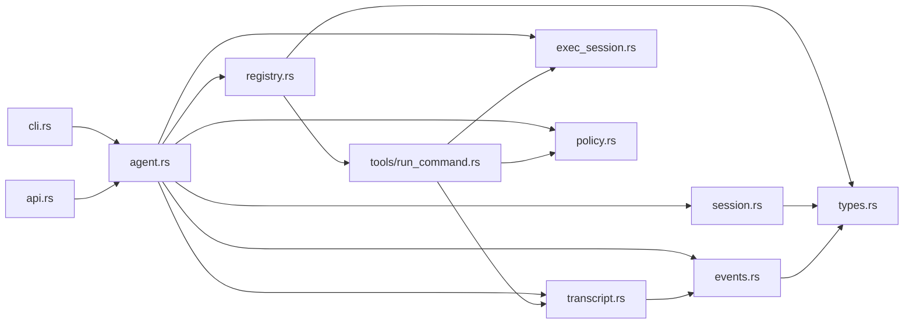
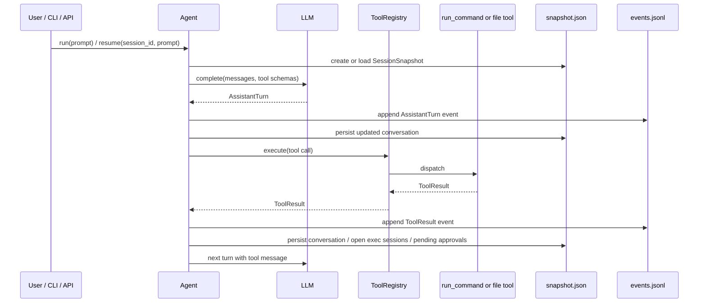
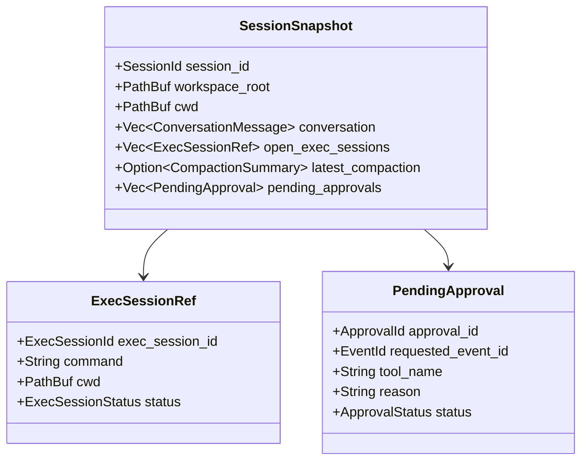
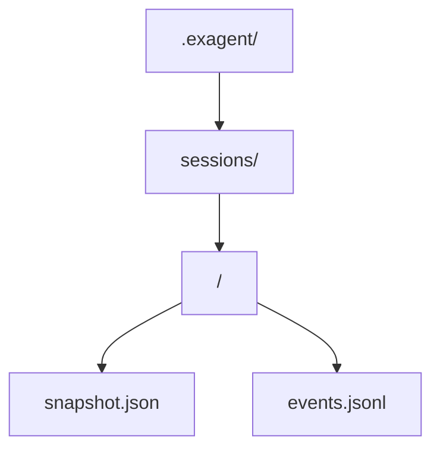
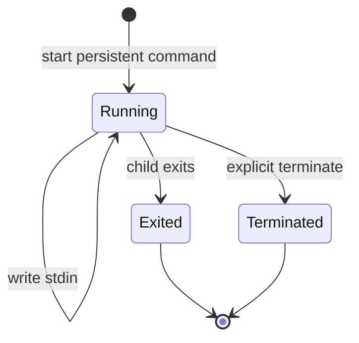
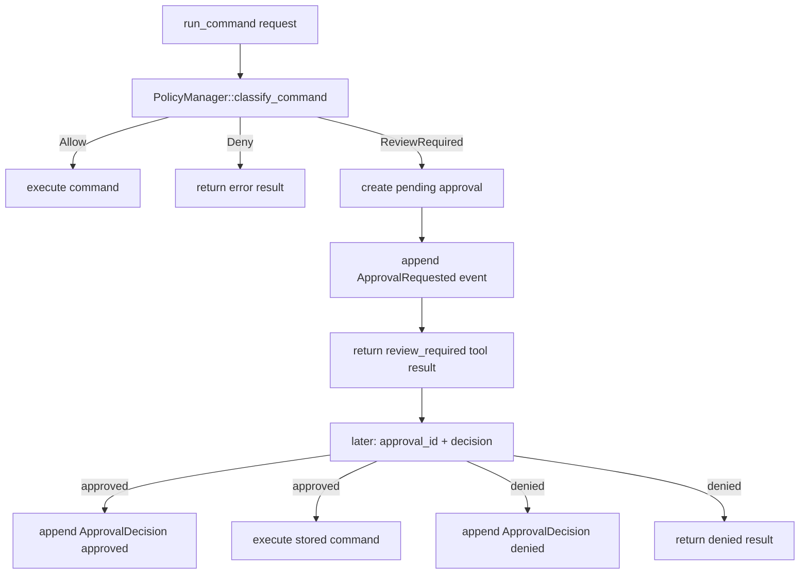

# ExAgent Phase 2 Runtime Study Guide

**Date:** 2026-04-15  
**Audience:** 自己学习、复盘、向后续阶段过渡  
**Status:** 对应当前 `codex/phase2-p0-runtime` worktree 的实现快照

## 1. 这份文档解决什么问题

Phase 1 的 ExAgent 已经证明了最小闭环：

`user -> llm -> tool call -> tool result -> next turn`

但它仍然偏“单次运行 demo”。Phase 2 P0 的目标，是把它推进成一个更像“运行时底座”的东西，让 agent 不只是会跑一轮，而是能：

- 持久化 session，而不是只留下松散 transcript
- 从旧 session 恢复，而不是只能每次重新开始
- 持有长生命周期进程，而不是所有命令都一次性执行
- 在危险命令前进入 approval 流程
- 通过结构化事件重放一次 run，而不是只看文本日志

这份文档只描述当前代码里**已经落地**的部分，不把设计稿里尚未实现的 compaction/eval 说成“已完成”。

## 2. 当前实现范围

### 已完成

- typed session / turn / event id
- `SessionSnapshot` 与 `RuntimeEvent`
- `.exagent/sessions/<session_id>/snapshot.json`
- `.exagent/sessions/<session_id>/events.jsonl`
- `Agent::resume(...)`
- `transcript::replay_session(...)`
- CLI `resume <session_id> <prompt>`
- HTTP `POST /run` 传 `session_id`
- persistent exec session
- exec stdout/stderr 事件流
- policy hook
- approval request / approve / deny
- pending approval 持久化到 session snapshot

### 还没做

- context compaction
- fork session
- scenario eval harness
- 更完整的 tool risk metadata
- 更强的 sandbox / OS-level isolation

## 3. 模块地图

### 核心文件

- `src/agent.rs`: 会话主循环，负责把 LLM、ToolRegistry、session persistence 串起来
- `src/session.rs`: session snapshot 结构，包含 open exec sessions / pending approvals
- `src/events.rs`: runtime event 枚举，记录 assistant/tool/exec/policy 等事件
- `src/transcript.rs`: session 路径、JSON/JSONL 读写、replay helper
- `src/exec_session.rs`: persistent process manager
- `src/policy.rs`: command classifier + approval cache
- `src/tools/run_command.rs`: one-shot command / persistent exec / approval decision 的统一入口
- `src/api.rs`: Axum API，暴露 `/health` 和 `/run`
- `src/cli.rs`: CLI 入口解析，支持 `run` / `resume` / `api`
- `src/registry.rs`: tool schema 注册与 tool dispatch

### 依赖方向



可以把它理解成三层：

1. 入口层：`cli.rs` / `api.rs`
2. 编排层：`agent.rs` / `registry.rs`
3. 运行时底座：`session.rs` / `events.rs` / `transcript.rs` / `exec_session.rs` / `policy.rs`

## 4. 一次 run 是怎么走的

最重要的代码是 `Agent::run_with_meta` 和 `Agent::run_session`。

它们做的事情不是“简单调用 LLM”，而是：

1. 创建或加载 `SessionSnapshot`
2. 构造 `ToolContext`
3. 把 conversation 送给 LLM
4. 把 assistant turn 先写成 `RuntimeEvent::AssistantTurn`
5. 逐个执行 tool call
6. 把 tool result 再写成 `RuntimeEvent::ToolResult`
7. 根据 tool result 的 metadata 反向更新 snapshot
8. 在 assistant 不再发 tool call 时结束

### 执行时序图



这里有个关键设计点：  
**snapshot 是“当前状态”，events 是“发生过什么”。**

这两个文件同时存在，解决的是两个不同问题：

- `snapshot.json` 让恢复更快
- `events.jsonl` 让回放和审计成为可能

## 5. Session 模型

`src/session.rs` 里的 `SessionSnapshot` 是当前运行时状态的最小可恢复集合：

- `session_id`
- `workspace_root`
- `cwd`
- `conversation`
- `open_exec_sessions`
- `latest_compaction`
- `pending_approvals`

### Session 快照结构图



当前实现里，`latest_compaction` 只是数据位，**还没有真正 compaction 流程**。这一点在复盘时要注意。

## 6. Event 模型

`src/events.rs` 里的 `RuntimeEvent` 是 runtime 的“事实记录”。

当前支持这些事件：

- `AssistantTurn`
- `ToolResult`
- `ExecOutput`
- `ApprovalRequested`
- `ApprovalDecision`
- `CompactionWritten`
- `RuntimeError`

其中最关键的是三类：

- `AssistantTurn`: 记录模型每轮输出
- `ToolResult`: 记录工具执行结果
- `ExecOutput`: 记录长生命周期进程的 stdout/stderr 分片

这意味着 replay 时可以回答两个问题：

1. agent 当时“想做什么”
2. runtime 实际“发生了什么”

## 7. 磁盘布局

当前持久化目录是：

```text
.exagent/
  sessions/
    <session_id>/
      snapshot.json
      events.jsonl
```

设计稿里提到的 `compaction/` 目录还没有真正使用。

### 持久化布局图



## 8. Resume 和 Replay 是怎么工作的

### Resume

`Agent::resume(session_id, user_prompt)` 的逻辑非常直接：

1. 用 `session_id` 定位到 `snapshot.json`
2. 读出旧 snapshot
3. 把新的 user prompt 追加到 conversation
4. 重新进入 `run_session`

当前版本的 resume 依赖 snapshot 中已有 conversation，而不是从 `events.jsonl` 重新构造全部上下文。这是一个很务实的取舍：

- 恢复成本低
- 逻辑简单
- replay 与 resume 职责分离

### Replay

`transcript::replay_session(...)` 当前只是把 `events.jsonl` 读回来，返回 `Vec<RuntimeEvent>`。

这很基础，但已经足够做两类事情：

- 调试具体某次 run
- 写基于事件的 regression test

## 9. Persistent Exec Session 是怎么接进来的

Phase 1 的 `run_command` 只有 one-shot command。  
Phase 2 新增了 `ExecSessionManager`，它持有：

- `session_id -> exec_session_id -> ActiveExecSession`

每个 `ActiveExecSession` 内部维护：

- 子进程句柄
- stdin 句柄
- stdout buffer
- stderr buffer
- lifecycle status
- exit code

### Exec 生命周期图



### 为什么需要两个输出路径

`run_command` 现在实际上有两种模式：

1. one-shot mode
2. persistent mode

one-shot mode 适合：

- `cargo test`
- `git status`
- `ls`

persistent mode 适合：

- 交互式 REPL
- 长时间后台进程
- 需要多轮 stdin 写入的场景

### 输出事件怎么记录

`ExecSessionManager` 在后台任务里读 stdout/stderr，并把每个 chunk 作为 `RuntimeEvent::ExecOutput` 追加到 `events.jsonl`。  
这意味着：

- snapshot 保存“当前 process 状态”
- event log 保存“过程中的输出流”

这个设计对调试很有价值，因为它不会把长进程输出挤进单个 tool result 里。

## 10. Policy / Approval 是怎么走的

`src/policy.rs` 当前实现了最小可用的审批边界：

- `PolicyMode::Off`
- `PolicyMode::Advisory`
- `PolicyMode::Enforced`

当前真正有行为差异的是 `Enforced`：

- 普通命令：直接执行
- 命中 risky pattern：返回 `review_required`
- 命中 hard deny pattern：直接拒绝

### Approval 流程图



### 当前策略是怎么判定“危险”的

它不是基于完整 shell parser，也不是 OS sandbox。  
当前只是简单字符串匹配：

- hard deny 例子：`rm -rf /`, `mkfs`
- review required 例子：`rm -rf`, `git reset --hard`, `git checkout --`, `shutdown`, `reboot`

这对 P0 来说足够证明 approval boundary，但还远远不是最终形态。

## 11. `run_command` 为什么是整个系统的交汇点

`src/tools/run_command.rs` 是当前 Phase 2 最密集的文件，因为它同时承载：

- one-shot command execution
- persistent exec start / poll / stdin / terminate
- policy classification
- approval request
- approval decision after user action

也就是说，Phase 2 当前最核心的 runtime 场景，实际上都汇聚在一个 tool 上。

这有两个优点：

- 行为集中，调试简单
- 暂时避免设计过多重叠工具

也有一个代价：

- `run_command` 已经开始承担过多分支逻辑

如果未来继续扩展，最可能演化的方向是：

- 把 approval decision 从 `run_command` 分离成 control tool
- 把 persistent exec lifecycle 单独抽象成更明确的 API

## 12. API 与 CLI 的定位

### CLI

`src/cli.rs` 当前只做入口解析：

- `run <prompt>`
- `resume <session_id> <prompt>`
- `api [bind_addr]`

CLI 仍然是最简单的本地入口。

### API

`src/api.rs` 用 Axum 包了一层最小 HTTP 面：

- `GET /health`
- `POST /run`

`POST /run` 支持可选 `session_id`，这意味着调用方可以：

- 不带 `session_id`：创建新 session
- 带 `session_id`：继续原 session

它的价值不在“产品 API”，而在于：

- 更容易做外部驱动测试
- 更容易接未来的 UI 或 eval harness

## 13. 学习顺序建议

如果你想高效复盘，不建议从 `run_command.rs` 硬读到底。  
推荐顺序是：

1. `src/types.rs`
2. `src/session.rs`
3. `src/events.rs`
4. `src/transcript.rs`
5. `src/agent.rs`
6. `src/registry.rs`
7. `src/tools/run_command.rs`
8. `src/exec_session.rs`
9. `src/policy.rs`
10. `src/api.rs` / `src/cli.rs`

原因是：

- 先看数据模型，后看流程
- 先看状态边界，后看命令执行
- 先理解 agent loop，后理解 persistent exec / policy 分支

## 14. 测试文件怎么对应功能

当前测试基本是按 runtime capability 拆开的：

- `tests/resume.rs`: session / event / resume / replay
- `tests/api_server.rs`: API `/run` 与 CLI `resume`
- `tests/exec_session.rs`: persistent exec 行为
- `tests/policy.rs`: approval hook
- `tests/run_command.rs`: one-shot command 基础行为
- `tests/agent_loop.rs`: agent 主循环的回归验证

复盘时建议把“测试文件”当成行为规格，而不是只盯着实现代码。

## 15. 这版架构最值得记住的几个判断

### 判断 1

Phase 2 的核心不是“多加工具”，而是先把 runtime primitive 稳定下来。

### 判断 2

snapshot 和 event log 必须并存，因为“恢复状态”和“重建过程”不是同一件事。

### 判断 3

persistent exec 是 coding agent 从“玩具”走向“可持续工作流”的关键一步。

### 判断 4

approval boundary 比完整 sandbox 更早落地，是合理的工程顺序。

### 判断 5

当前代码已经具备 durable runtime 的骨架，但还没有进入“长 session 管理成熟”的阶段；compaction 和 eval 仍然是下一阶段重点。

## 16. 一句话总结

当前 Phase 2 P0 已经把 ExAgent 从“只会跑一轮的 agent loop”推进到了“带 session、event log、resume、persistent exec 和 approval hook 的运行时底座”；它还不完整，但骨架已经从 demo 变成了可继续生长的 runtime。
