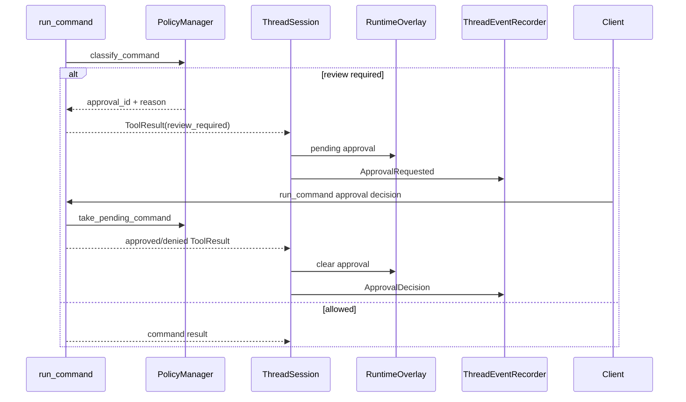

# Approval Flow

Approval is used when command policy requires review before running a risky command.

## Key State Changes

- `PolicyManager.pending` stores the in-memory command approval waiter.
- `RuntimeOverlay.pending_approvals` exposes pending approval state to live thread views.
- `ApprovalRequested` and `ApprovalDecision` are persisted events.
- Interrupting a waiting approval clears overlay approvals and policy-side waiters.

## Main Files

- `src/runtime/policy.rs`
- `src/tools/run_command.rs`
- `src/runtime/tool_call_runtime.rs`
- `src/runtime/thread_session/turn.rs`
- `src/runtime/thread_session/overlay.rs`
