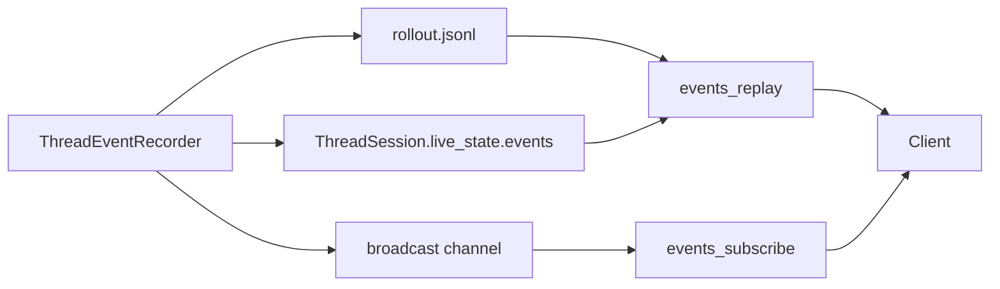

# Event Replay And Subscription

Events have two paths: durable replay from rollout and live subscription from a loaded runtime.

## Rules

- `rollout.jsonl` is the durable source of truth.
- Live event buffers are bounded and only for loaded runtime state.
- `events/subscribe` sends replayed events first, then switches to live broadcast events.
- Not every event needs to be persisted. Persistence policy lives in `state/rollout.rs`.

## Main Files

- `src/runtime/thread_session/events.rs`
- `src/state/events.rs`
- `src/state/rollout.rs`
- `src/app_server/thread_manager.rs`
- `src/entrypoints/api.rs`
