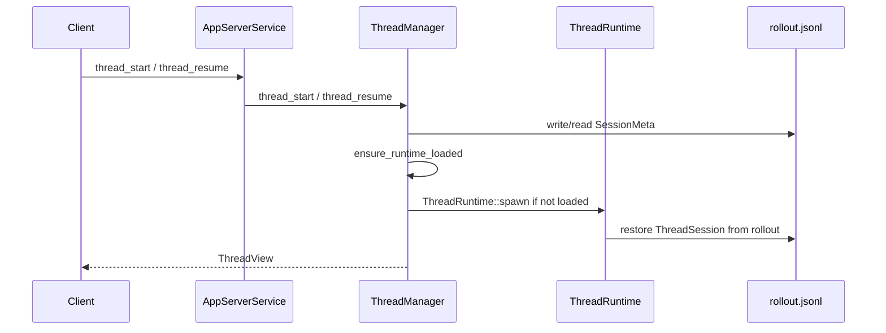

# Thread Lifecycle

Thread lifecycle is coordinated by `ThreadManager`.

## Key State Changes

- New threads create a `SessionMeta` rollout item.
- Resumed threads must already have a non-empty rollout.
- Loaded runtime instances are cached in `ThreadManager.loaded_threads`.
- Cold replay restores durable snapshot/events but does not recreate open subprocesses or pending approval waiters.

## Main Files

- `src/app_server/thread_manager.rs`
- `src/runtime/thread_runtime.rs`
- `src/runtime/thread_session/mod.rs`
- `src/state/rollout.rs`
