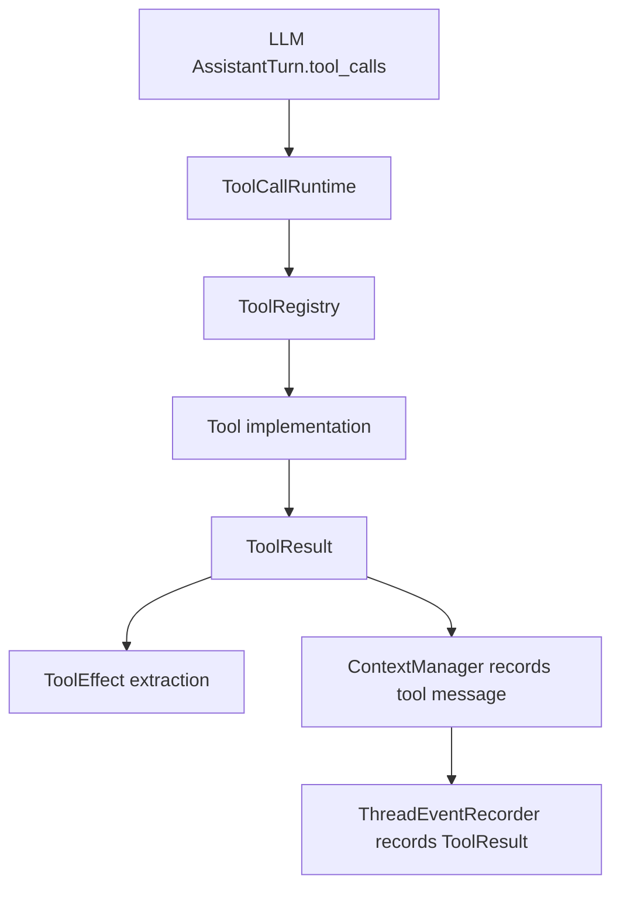

# Tool Call Lifecycle

Tool calls are produced by the LLM and executed through `ToolCallRuntime`.

## Key State Changes

- Tool result content is serialized into a `ConversationMessage::tool`.
- Tool effects may update live overlay state before the `ToolResult` event is recorded.
- Persistent command metadata can add or remove open exec session refs.
- Approval metadata can add or clear pending approval refs.

## Main Files

- `src/runtime/thread_session/turn.rs`
- `src/runtime/tool_call_runtime.rs`
- `src/tools/registry.rs`
- `src/tools/read_file.rs`
- `src/tools/write_file.rs`
- `src/tools/run_command.rs`
