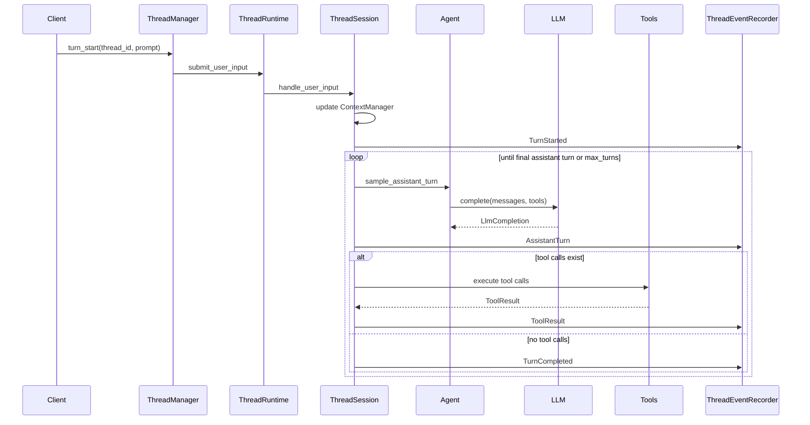

# Turn Lifecycle

This is the main path for one user prompt.

## Key State Changes

1. `ThreadRuntime.active_turn` is reserved before the operation is queued.
2. `ThreadSession` sets status to `Running`.
3. `ContextManager` records runtime context and the user message.
4. Rollout receives `TurnContext`, conversation items, and persisted events.
5. `ThreadEventRecorder` updates `ThreadSession.live_state` and broadcasts events.
6. The turn completes when the model returns an assistant turn with no tool calls.

## Important Branches

- If token budget is exceeded before a turn, compaction may run before the new user message.
- If the LLM reports a context-window error, runtime can compact and retry when a model context window is configured.
- If a tool requests approval, the turn can enter a waiting approval state.
- If interrupted, a `TurnInterrupted` event is recorded.

## Main Files

- `src/app_server/thread_manager.rs`
- `src/runtime/thread_runtime.rs`
- `src/runtime/thread_session/turn.rs`
- `src/runtime/agent.rs`
- `src/runtime/thread_session/events.rs`
