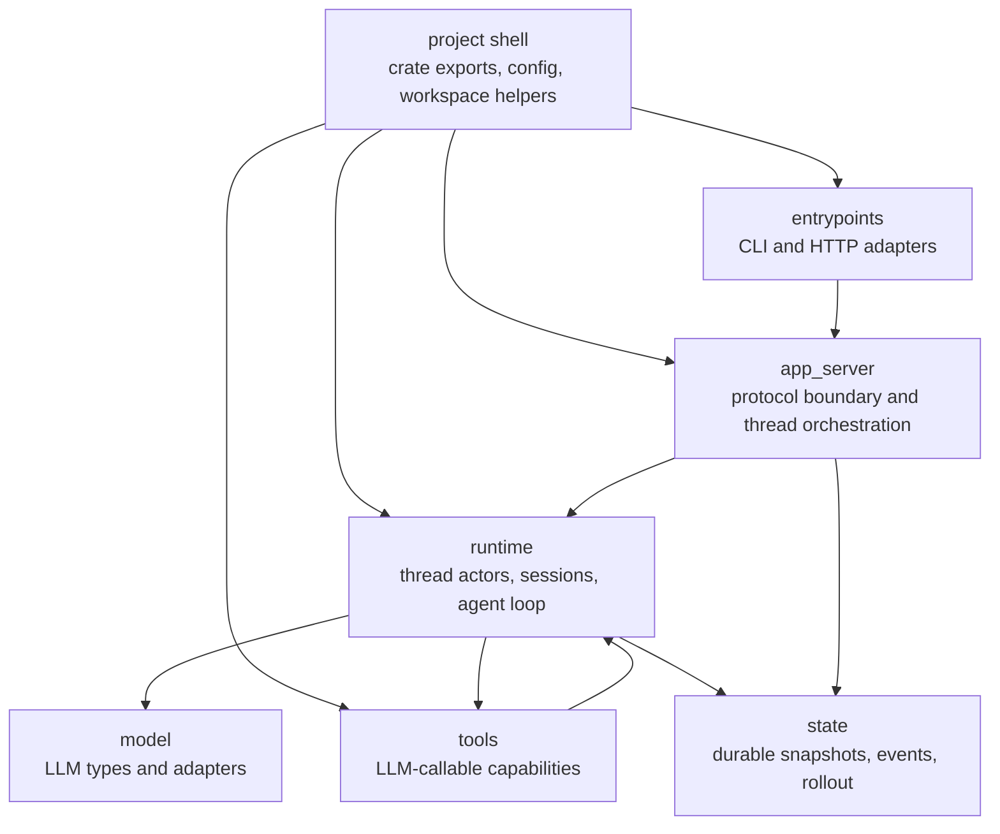

# Module Map

ExAgent has six main logical modules plus a small project shell that wires crate and process boundaries.

## Reading Order

1. `project shell`: how the crate starts, exports defaults, and shares config/path helpers.
2. `entrypoints`: how requests enter the system.
3. `app_server`: how threads and turns are exposed as a boundary.
4. `runtime`: how a loaded thread executes work.
5. `state`: how runtime facts become durable and replayable.
6. `tools`: what the model can call.
7. `model`: how internal messages map to an LLM provider.

## Ownership Summary

- `project shell` owns process startup wiring, crate exports, default config, and shared workspace path helpers.
- `entrypoints` owns transport details only.
- `app_server` owns protocol-level orchestration and loaded runtime lookup.
- `runtime` owns active execution and live thread state.
- `state` owns durable data shapes and rollout persistence.
- `tools` owns callable tool implementations and schemas.
- `model` owns LLM-facing message/completion types and provider adapters.
