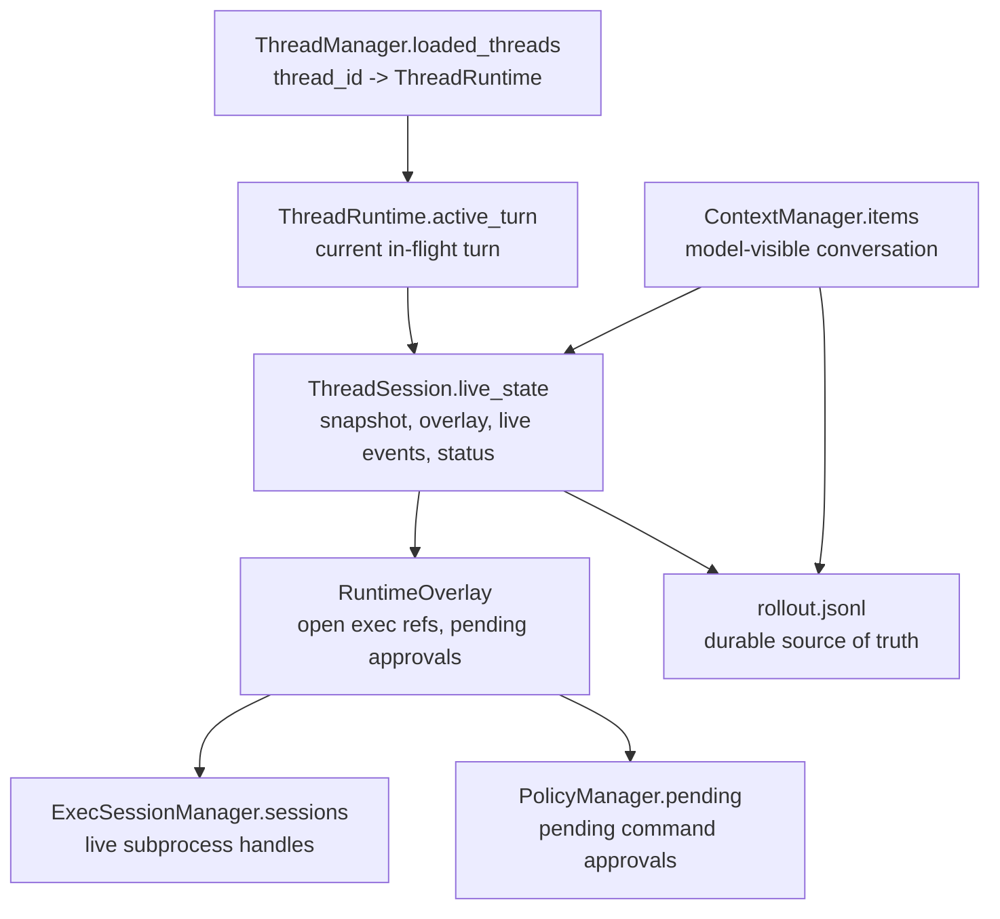

# State Map

State is split into durable state, live state, and model-visible history.

## Durable State

- Owner: `state/rollout.rs`.
- File: `.exagent/threads/<thread_id>/rollout.jsonl`.
- Contains: session metadata, conversation items, turn context, compaction checkpoints, selected runtime events.
- Purpose: cold recovery, audit, replay.

## Live State

- Owner: `runtime/thread_session/mod.rs`.
- Field: `ThreadSession.live_state`.
- Contains: current `SessionSnapshot`, live-only `RuntimeOverlay`, bounded live event buffer, runtime status.
- Purpose: fast `thread_read`, active event subscription, UI state.

## Model-Visible History

- Owner: `runtime/context.rs`.
- Field: `ContextManager.items`.
- Contains: messages that will be sent to the LLM.
- Purpose: prompt construction, context update injection, compaction replacement.

## Live-Only State

- `RuntimeOverlay.open_exec_sessions`: references to currently open persistent commands.
- `RuntimeOverlay.pending_approvals`: approvals waiting for a decision.
- `ExecSessionManager.sessions`: actual subprocess handles; never recreated by cold replay.
- `PolicyManager.pending`: approval waiters used by command policy.

## Rule Of Thumb

If state must survive process restart, it belongs in rollout. If it represents an active process, channel, or pending in-memory waiter, it belongs in live state or overlay.
