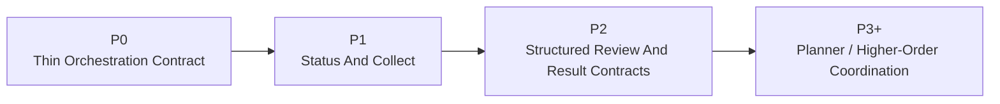
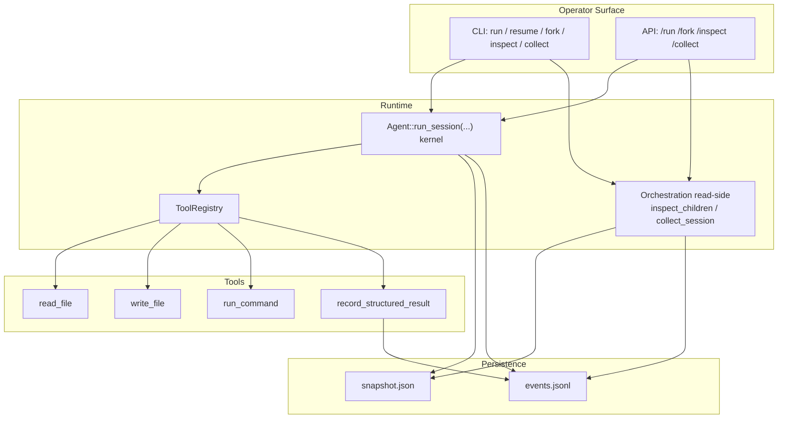
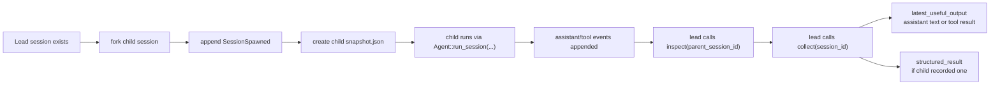
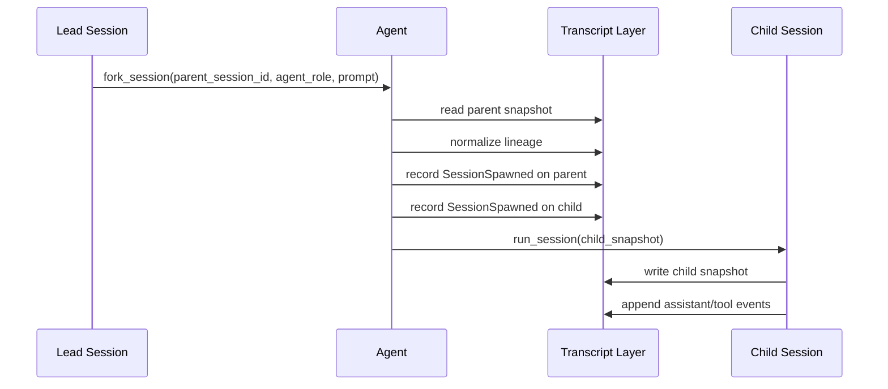
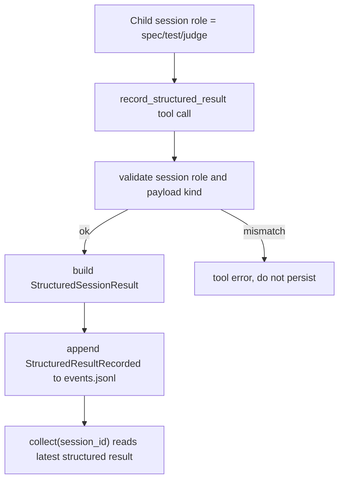

# ExAgent Phase 3 Current-State Learning Guide

**Date:** 2026-04-15  
**Status:** Current-state consolidation after Phase 3 `P0`, `P1`, and `P2`  
**Audience:** Developers who want to understand what Phase 3 already does today, what it does not do yet, and how the current orchestration path actually works in code

## Reading Pack

This file is the landing-page overview. For more detailed study, use it together with:

- [Phase 3 Concepts And Boundaries](/Volumes/EXEXEX/ExAgent/docs/plans/2026-04-15-exagent-phase3-concepts-and-boundaries.md:1)
- [Phase 3 Runtime Flows And Persistence Guide](/Volumes/EXEXEX/ExAgent/docs/plans/2026-04-15-exagent-phase3-runtime-flows-and-persistence-guide.md:1)
- [Phase 3 Code Reading And Test Map](/Volumes/EXEXEX/ExAgent/docs/plans/2026-04-15-exagent-phase3-code-reading-and-test-map.md:1)
- [Phase 3 Step-By-Step Code Walkthrough](/Volumes/EXEXEX/ExAgent/docs/plans/2026-04-15-exagent-phase3-step-by-step-code-walkthrough.md:1)
- [Phase 3 Hands-On Filesystem Lab](/Volumes/EXEXEX/ExAgent/docs/plans/2026-04-15-exagent-phase3-hands-on-filesystem-lab.md:1)

## 1. One-Sentence Summary

Today, Phase 3 has already turned ExAgent from a durable single-session runtime into a thin but usable multi-session orchestration runtime:

- `P0` gave it `fork`, lineage, roles, and replayable spawn events
- `P1` gave it read-side `inspect` and `collect`
- `P2` gave it typed structured result contracts for `spec`, `test`, and `judge`

What it still does **not** have is planner-style decomposition, mailbox coordination, automatic reduce/join, or higher-order scheduling.

## 2. The Most Important Distinction

There are **two different things** that are easy to confuse:

1. The **development workflow**
   `Lead -> Spec -> Test -> Judge -> Implementation`
2. The **product/runtime capabilities**
   `fork -> inspect -> collect -> structured_result`

Phase 3 implemented the second category.

It did **not** implement autonomous `Spec Agent`, `Test Agent`, or `Judge Agent` behaviors. Instead, it implemented runtime support so that sessions carrying those roles can be created, isolated, inspected, collected, and, for non-writer roles, can publish a typed result contract.

That means the current system supports the workflow, but it does not yet automate the workflow.

## 3. What Is Done So Far

### P0: Thin Orchestration Contract

Implemented:

- parent/child lineage in `SessionSnapshot`
- `AgentRole`
- replayable `SessionSpawned` events
- `Agent::fork_session(...)`
- thin CLI/API fork entrypoints
- sibling isolation regressions

Code anchors:

- [src/session.rs](/Volumes/EXEXEX/ExAgent/src/session.rs:1)
- [src/events.rs](/Volumes/EXEXEX/ExAgent/src/events.rs:1)
- [src/agent.rs](/Volumes/EXEXEX/ExAgent/src/agent.rs:1)
- [tests/orchestration.rs](/Volumes/EXEXEX/ExAgent/tests/orchestration.rs:1)

### P1: Status And Collect

Implemented:

- `inspect(parent_session_id)` for direct-child discovery
- derived child status: `completed`, `running`, `waiting_approval`
- `collect(session_id)` for a stable latest useful output view
- CLI/API inspect and collect surfaces

Code anchors:

- [src/orchestration.rs](/Volumes/EXEXEX/ExAgent/src/orchestration.rs:1)
- [src/api.rs](/Volumes/EXEXEX/ExAgent/src/api.rs:1)
- [src/cli.rs](/Volumes/EXEXEX/ExAgent/src/cli.rs:1)

### P2: Structured Review And Result Contracts

Implemented:

- versioned typed result envelope for `spec`, `test`, and `judge`
- `StructuredResultRecorded` event in the event log
- `record_structured_result` tool for child-owned typed result publication
- additive `structured_result` on `collect(session_id)`

Code anchors:

- [src/result_contract.rs](/Volumes/EXEXEX/ExAgent/src/result_contract.rs:1)
- [src/tools/record_structured_result.rs](/Volumes/EXEXEX/ExAgent/src/tools/record_structured_result.rs:1)
- [src/transcript.rs](/Volumes/EXEXEX/ExAgent/src/transcript.rs:1)

## 3.5 Milestone Map

## 4. What Is Explicitly Not Done Yet

Phase 3 currently does **not** include:

- planner or task-graph decomposition
- mailbox or actor-style coordination
- automatic reduce/join across many child sessions
- cross-session autonomous routing
- compaction-aware orchestration
- eval harnesses for long orchestration sessions

Those are later `P3+` concerns, not part of the current baseline.

## 5. Core Mental Model

The easiest way to understand the current system is:

`Agent::run_session(...)` is still the single-session execution kernel.  
Phase 3 layers orchestration **around** that kernel rather than replacing it.

In practice, the orchestration model is:

1. A parent session forks a child session.
2. The child session gets its own snapshot and event log.
3. The parent can later inspect direct children.
4. The lead can collect one child session's outputs.
5. For `spec` / `test` / `judge`, the child can additionally persist a typed structured result.

That means the current architecture is intentionally thin: one execution kernel, plus orchestration metadata, plus read-side extraction.

## 6. Persistence Model

There are two primary on-disk artifacts per session:

- `snapshot.json`
- `events.jsonl`

### `snapshot.json`

This is the persisted current state of a session.

It carries:

- `session_id`
- `parent_session_id`
- `root_session_id`
- `spawned_by_turn_id`
- `agent_role`
- `workspace_root`
- `cwd`
- current conversation
- open exec sessions
- approvals
- compaction summary

### `events.jsonl`

This is the append-only event log.

It carries replayable runtime facts such as:

- `AssistantTurn`
- `ToolResult`
- `SessionSpawned`
- `ApprovalRequested`
- `ApprovalDecision`
- `StructuredResultRecorded`

The rule of thumb is:

- snapshot = current session state
- events = replayable historical facts

For P2 structured review output, the canonical persisted source is the **event log**, not the snapshot.

## 7. Architecture Diagram

## 8. Main Runtime Flow

This is the core Phase 3 path from lead orchestration point of view:

## 9. Fork And Replay Flow

The `fork` path is the foundation of everything else:

Key point:

The parent and child are linked by lineage and spawn events, but their disk artifacts are still isolated by session directory.

## 10. Inspect Flow

`inspect(parent_session_id)` is intentionally narrow.

It does:

1. read the parent session event log
2. scan `SessionSpawned` events
3. extract direct child session ids in stable spawn order
4. hydrate each child from its own snapshot
5. derive a thin lifecycle status

It returns:

- direct children only
- lineage metadata
- role metadata
- status
- artifact paths

It does **not** return:

- legacy content
- structured review body
- reduce/join output
- any mutating control action

That is why `inspect` should be thought of as topology/status only.

## 11. Collect Flow

`collect(session_id)` is the main lead-facing read path for one child session.

Today it returns a `CollectedChildSession`:

- `child`
- optional `structured_result`
- optional `latest_useful_output`

The intended interpretation is:

- if `structured_result` exists, that is the preferred typed handoff
- `latest_useful_output` still remains available for backward compatibility and human-readable context

The current code keeps `structured_result` **additive**, not replacement. That was a deliberate P2 choice so P1 behavior would not break.

## 12. Structured Result Flow

For `spec`, `test`, and `judge`, the child can persist a typed result contract through the `record_structured_result` tool.

Important behavior:

- only `spec`, `test`, and `judge` may publish this P2 contract
- payload kind must match session role
- latest persisted structured-result event wins
- read-side extraction does not rewrite the snapshot

## 13. Current Structured Result Schema

The common envelope contains:

- `schema_version`
- `agent_role`
- `session_id`
- `parent_session_id`
- `source_turn_id`
- `summary`
- `assumptions`
- `risks`
- `open_questions`
- `payload`

Role-specific payloads:

- `spec`
  - `goals`
  - `non_goals`
  - `acceptance_criteria`
  - `contract_boundaries`
- `test`
  - `regression_risks`
  - `test_matrix`
  - `coverage_gaps`
- `judge`
  - `scope_issues`
  - `missing_criteria`
  - `blockers`
  - `recommendation`

This lives in [src/result_contract.rs](/Volumes/EXEXEX/ExAgent/src/result_contract.rs:1).

## 14. Minimal End-To-End Learning Walkthrough

If you want one mental example to remember the whole system, use this:

1. A lead session runs.
2. The lead forks a `spec` child.
3. The fork writes lineage to snapshots and `SessionSpawned` to event logs.
4. The child runs as an ordinary session.
5. The child calls `record_structured_result` with a `spec` payload.
6. That appends `StructuredResultRecorded` to the child event log.
7. The lead calls `inspect(parent_session_id)` and sees the child in direct-child order.
8. The lead calls `collect(child_session_id)` and gets:
   - child metadata
   - the typed structured result
   - the legacy latest useful output

That is the current complete Phase 3 story.

## 15. File Map For Study

If you want to learn the implementation in the fastest order, read these files in sequence:

1. [docs/plans/2026-04-15-exagent-phase3-roadmap-and-working-model-design.md](/Volumes/EXEXEX/ExAgent/docs/plans/2026-04-15-exagent-phase3-roadmap-and-working-model-design.md:1)
2. [src/session.rs](/Volumes/EXEXEX/ExAgent/src/session.rs:1)
3. [src/events.rs](/Volumes/EXEXEX/ExAgent/src/events.rs:1)
4. [src/transcript.rs](/Volumes/EXEXEX/ExAgent/src/transcript.rs:1)
5. [src/agent.rs](/Volumes/EXEXEX/ExAgent/src/agent.rs:1)
6. [src/orchestration.rs](/Volumes/EXEXEX/ExAgent/src/orchestration.rs:1)
7. [src/result_contract.rs](/Volumes/EXEXEX/ExAgent/src/result_contract.rs:1)
8. [src/tools/record_structured_result.rs](/Volumes/EXEXEX/ExAgent/src/tools/record_structured_result.rs:1)
9. [src/api.rs](/Volumes/EXEXEX/ExAgent/src/api.rs:1)
10. [tests/orchestration.rs](/Volumes/EXEXEX/ExAgent/tests/orchestration.rs:1)
11. [tests/structured_contracts.rs](/Volumes/EXEXEX/ExAgent/tests/structured_contracts.rs:1)
12. [tests/api_server.rs](/Volumes/EXEXEX/ExAgent/tests/api_server.rs:1)

## 16. Current Contract Boundaries

To avoid confusion, keep these boundaries in your head:

- `fork` creates child sessions and lineage
- `inspect` answers "what child sessions exist and what state do they look like"
- `collect` answers "what can I consume from this one child session"
- `structured_result` is typed handoff data for `spec` / `test` / `judge`
- `latest_useful_output` is still the legacy human-readable fallback
- `AgentRole` is metadata, not autonomous behavior

## 17. What You Should Not Infer

Do **not** infer the following from the current codebase:

- that ExAgent already has a planner
- that the workflow is automatically orchestrated
- that `spec/test/judge` are autonomous system agents
- that collect can already summarize many children into one result
- that P3+ is already designed in implementation detail

Those are exactly the things that remain for later work.

## 18. Suggested Study Order

If you are learning this system from scratch, use this order:

1. Read the roadmap and understand the milestone boundaries.
2. Read this overview once from top to bottom.
3. Follow the step-by-step walkthrough while reading the exact code blocks in order.
4. Run the hands-on filesystem lab so the persistence model becomes concrete.
5. Read `SessionSnapshot` and `RuntimeEventKind` again after the walkthrough.
6. Read transcript persistence helpers.
7. Read orchestration `inspect` and `collect`.
8. Read the structured-result contract and tool.
9. Read orchestration, structured-contract, and resume tests.

If you keep that order, the current Phase 3 design becomes much easier to hold in your head.
