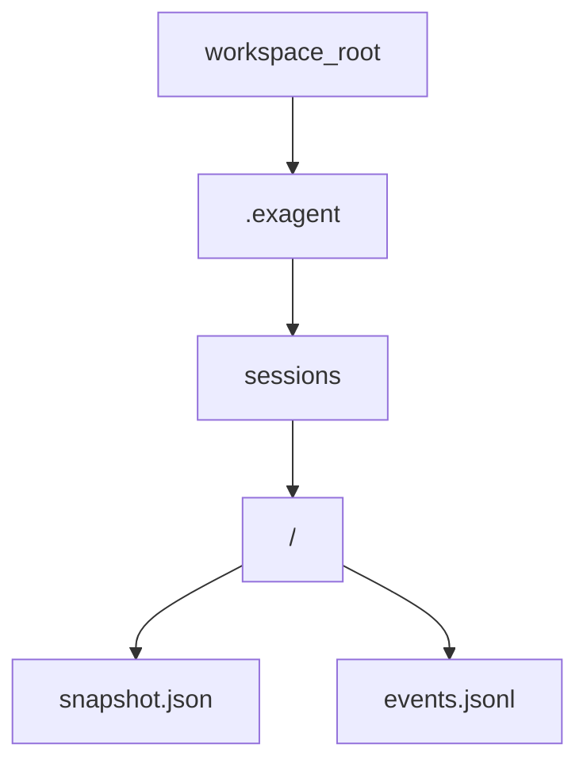
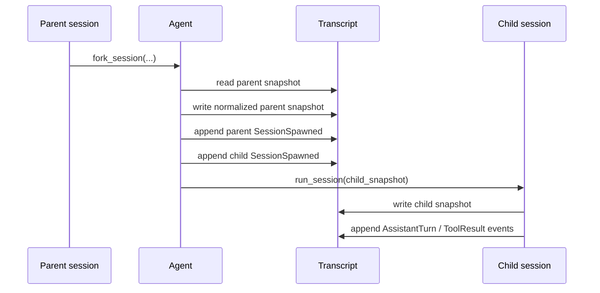
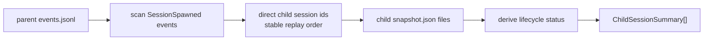
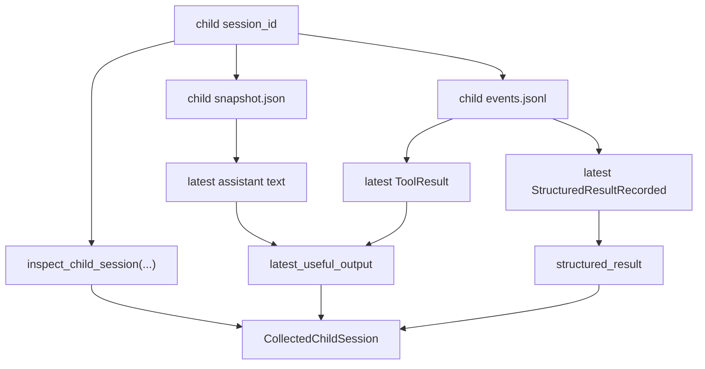
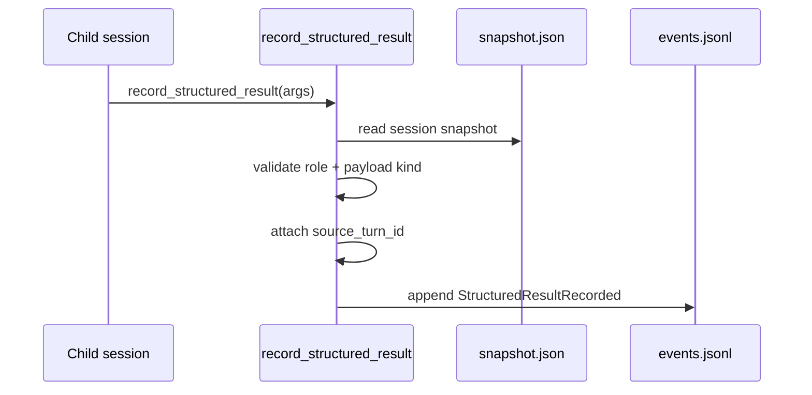

# ExAgent Phase 3 Runtime Flows And Persistence Guide

**Date:** 2026-04-15  
**Status:** Detailed runtime and persistence walkthrough for current Phase 3  
**Audience:** Readers who want to follow the actual data flow from fork to collect

## 1. The Two Persistence Artifacts

Every session directory currently centers on two persisted files:

- `snapshot.json`
- `events.jsonl`

The easiest rule to remember is:

- snapshot stores the current state you want to reopen quickly
- event log stores replayable facts in append order

### Snapshot Responsibilities

Snapshot currently carries:

- session identity
- lineage metadata
- role metadata
- workspace and cwd context
- conversation state
- open exec sessions
- approvals
- compaction summary

### Event Log Responsibilities

Event log currently carries:

- assistant turns
- tool results
- spawn events
- approval request/decision events
- structured review/result events

P2 made one boundary especially important:

- typed review outputs live canonically in the **event log**
- they are not mirrored back into the snapshot as a derived field

## 2. Session Directory Layout

Sibling children get separate directories under `.exagent/sessions/`, which is why disk isolation is so important and testable.

## 3. Fork Flow In Detail

Forking a child does not create a new orchestration subsystem. It reuses the existing session kernel and wraps a small amount of lineage logic around it.

Detailed steps:

1. Read parent snapshot.
2. Normalize parent lineage.
3. Derive child snapshot via `fork_child(...)`.
4. Record `SessionSpawned` on the parent event log.
5. Record `SessionSpawned` on the child event log.
6. Run the child through `Agent::run_session(...)`.

### Fork Sequence

## 4. Why Replay Works

Replay works because the important orchestration facts are explicit events:

- parent-child creation is in `SessionSpawned`
- structured review handoff is in `StructuredResultRecorded`

That means a lead does not need hidden in-memory state to rediscover the child topology or typed result contract after restart.

## 5. Inspect Flow In Detail

`inspect(parent_session_id)` works like a thin read-side extractor.

Detailed steps:

1. Open the parent event log.
2. Scan for `SessionSpawned`.
3. Keep only events whose `parent_session_id` matches the requested parent.
4. Deduplicate child ids while preserving replay order.
5. Open each child snapshot.
6. Build a `ChildSessionSummary`.
7. Derive lifecycle status from current snapshot state.

### Inspect Data Flow

### Status Derivation

Current status derivation is intentionally small:

- `waiting_approval` if approvals are present
- `running` if open exec sessions exist and approvals do not
- `completed` otherwise

This means inspect is useful operationally, but it is not pretending to be a full scheduler state machine.

## 6. Collect Flow In Detail

`collect(session_id)` works on one child session at a time.

Detailed steps:

1. Build the same child summary used by inspect.
2. Read the child snapshot.
3. Read the child event log.
4. Read the latest structured result event if one exists.
5. Read the latest useful legacy output.
6. Return one `CollectedChildSession`.

### Collect Data Flow

## 7. Legacy Output Precedence

Current legacy output precedence is:

1. latest assistant text with non-empty content
2. else latest tool result
3. else no legacy output

This logic predates P2 and remains in place for backward compatibility.

P2 did **not** replace that view. It added a parallel typed path:

- `structured_result` when present
- `latest_useful_output` still preserved

## 8. Structured Result Write Flow

The child-owned typed result path works through `record_structured_result`.

Detailed steps:

1. Tool receives structured payload arguments.
2. Tool loads the current session snapshot.
3. Tool checks the session role.
4. Tool checks that payload kind matches the role.
5. Tool captures the current runtime `turn_id`.
6. Tool builds `StructuredSessionResult`.
7. Tool appends `StructuredResultRecorded` to the child event log.

### Structured Result Sequence

## 9. Role Validation Rules

Current validation rules are strict:

- `spec` session may only write `spec` payload
- `test` session may only write `test` payload
- `judge` session may only write `judge` payload
- `primary` and `implementation` cannot publish a P2 structured review result

This is why the typed contract still means something. Without role validation, structured results would become untrustworthy metadata.

## 10. Resume Semantics

Resume does not replace a session. It continues the same session id.

That matters for P2 because multiple structured results may exist in the same event log after resume.

Current rule:

- latest persisted `StructuredResultRecorded` wins

This is a straightforward append-only rule and is much safer than trying to infer “the final result” from timestamps or snapshot mutation order.

## 11. Where Compaction Fits Today

Compaction already exists in the runtime state model, but current orchestration is not yet compaction-aware at the higher-order level.

What that means:

- compaction summary can exist in snapshot state
- current inspect/collect logic does not yet build special orchestration semantics around compaction

That omission is deliberate and belongs to later `P3+` work.

## 12. Practical Debugging Heuristics

If something looks wrong in current Phase 3 behavior, inspect in this order:

1. child `snapshot.json`
2. child `events.jsonl`
3. parent `events.jsonl`
4. `SessionSpawned` ordering
5. latest `StructuredResultRecorded`

Common failure classes map cleanly to persisted artifacts:

- missing child in inspect: usually parent event log
- wrong status: usually child snapshot state
- missing typed result: usually child event log or role mismatch
- stale typed result after resume: latest structured-result event selection

## 13. Suggested Reading After This File

If you want the code-level map after understanding these flows, continue with:

- [Phase 3 Code Reading And Test Map](/Volumes/EXEXEX/ExAgent/docs/plans/2026-04-15-exagent-phase3-code-reading-and-test-map.md:1)
